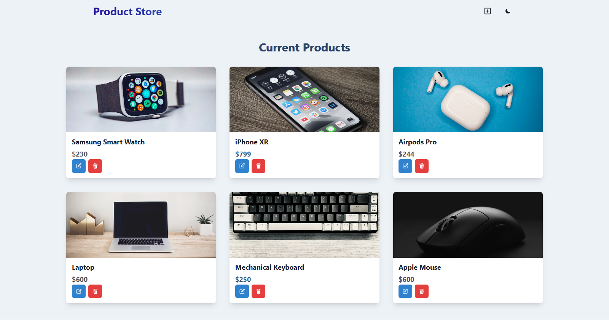

# Product Store

A full-stack MERN application for managing product inventory with CRUD operations.



## Features

- **Product Management**: Create, read, update, and delete products
- **Responsive Design**: Works on mobile, tablet, and desktop
- **Dark/Light Mode**: Toggle between dark and light themes
- **Modern UI**: Built with Chakra UI for a clean, modern interface

## Tech Stack

### Frontend
- React 19
- React Router DOM
- Chakra UI
- Zustand (State Management)
- Vite (Build Tool)

### Backend
- Node.js
- Express
- MongoDB
- Mongoose

## Installation

### Prerequisites
- Node.js (v16+)
- MongoDB (local or Atlas)

### Setup

1. **Clone the repository**
   ```
   git clone <repository-url>
   cd Product\ Store-\ Crash\ Course
   ```

2. **Environment Variables**
   
   Create a `.env` file in the root directory with the following:
   ```
   PORT=5000
   MONGO_URI=mongodb+srv://<username>:<password>@<cluster>.mongodb.net/<database>?retryWrites=true&w=majority
   NODE_ENV=development
   ```

3. **Install Dependencies**
   ```
   # Install backend dependencies
   npm install
   
   # Install frontend dependencies
   cd frontend
   npm install
   ```

## Running the Application

### Development Mode

1. **Start the backend server**
   ```
   # From the root directory
   npm run dev
   ```

2. **Start the frontend development server**
   ```
   # From the frontend directory
   npm run dev
   ```

3. **Access the application**
   - Backend: http://localhost:5000
   - Frontend: http://localhost:5173 (or the port shown in your terminal)

### Production Mode

1. **Build the frontend**
   ```
   # From the frontend directory
   npm run build
   ```

2. **Start the production server**
   ```
   # From the root directory
   npm run start
   ```

3. **Access the application**
   - http://localhost:5000

## Database Seeding

To populate your database with sample products:

```
# From the root directory
node backend/seed.js
```

## Project Structure

```
Product Store- Crash Course/
├── backend/
│   ├── config/
│   │   └── db.js
│   ├── controller/
│   │   └── product.controller.js
│   ├── models/
│   │   └── product.model.js
│   ├── routes/
│   │   └── product.route.js
│   ├── seed.js
│   └── server.js
├── frontend/
│   ├── public/
│   ├── src/
│   │   ├── components/
│   │   ├── pages/
│   │   ├── store/
│   │   ├── App.jsx
│   │   ├── main.jsx
│   │   └── index.css
│   ├── index.html
│   └── package.json
├── .env
├── .gitignore
├── package.json
└── README.md
```

## API Endpoints

| Method | Endpoint | Description |
|--------|----------|-------------|
| GET    | /api/products | Get all products |
| POST   | /api/products | Create a new product |
| PUT    | /api/products/:id | Update a product |
| DELETE | /api/products/:id | Delete a product |

## Contributing

1. Fork the repository
2. Create your feature branch (`git checkout -b feature/amazing-feature`)
3. Commit your changes (`git commit -m 'Add some amazing feature'`)
4. Push to the branch (`git push origin feature/amazing-feature`)
5. Open a Pull Request

## License

This project is licensed under the MIT License - see the LICENSE file for details.